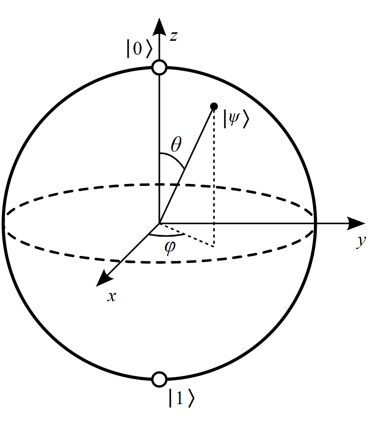
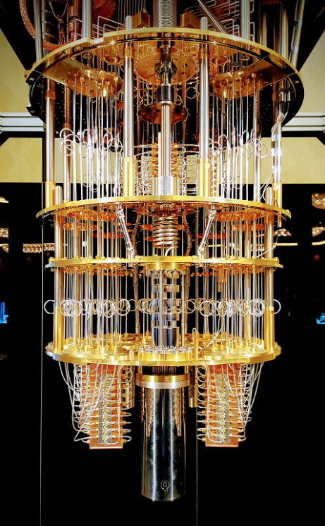

# What is Quantum Computing?

## Introduction

Quantum computing is a new type of computing that uses principles from **quantum physics** to process information.  
Unlike classical computers that use **bits (0 or 1)**, quantum computers use **qubits**, which can exist in multiple states at the same time.

Because of this, quantum computers have the potential to solve certain problems much faster than traditional computers.

---

## Classical Computing vs Quantum Computing

| Classical Computing | Quantum Computing |
|---------------------|------------------|
| Uses bits (0 or 1) | Uses qubits |
| Processes data sequentially | Can explore many possibilities at once |
| Based on classical physics | Based on quantum mechanics |

---

## Basic Idea of a Qubit

A **qubit** is the basic unit of quantum information.  
Unlike a classical bit, a qubit can represent **0, 1, or both simultaneously**.  
This property is called **superposition**.

---

## Important Concepts

### Superposition

Superposition allows a quantum system to exist in **multiple states simultaneously**, allowing quantum computers to analyze many possible solutions at once.

### Entanglement

Entanglement occurs when two qubits become linked so that the state of one qubit instantly affects the other.

---

## Example of Quantum Computer Hardware

Quantum computers require specialized hardware and are often operated at **extremely low temperatures** to maintain stable qubits.

---

## Potential Applications

Quantum computing could help solve problems in areas such as:

- Drug discovery  
- Cryptography  
- Optimization problems  
- Climate modeling  
- Artificial intelligence  

---

## Conclusion

Quantum computing represents a new approach to computation based on the laws of quantum mechanics. Although still experimental, it has the potential to solve problems that are difficult for classical computers.